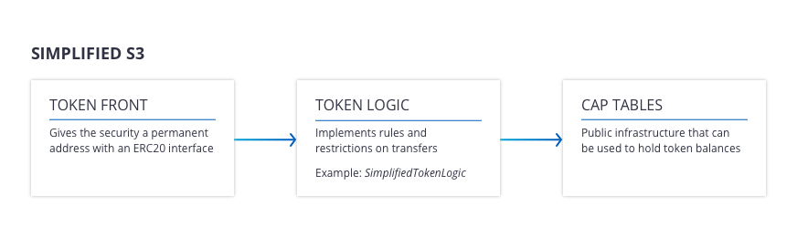

OpenFinance S3 - Smart Securities Standard
==

Overview
--

S3 has grown out of the OpenFinance Network's efforts to automate certain
aspects of running a compliant alternatives exchange.  Currently, it consists
of a smart contract library and a typescript library for manipulating these
contracts.  However, the full scope includes a standard protocol that exchanges
an compliance providers can use to communicate in order to maintain the trading
invariants required by the SEC for securities to keep their filing exemptions.

Contributing
--

If you would like to contribute, please see `contributing.md` before you begin.
Then, take a look at the [setup instructions](#setting-up-for-s3-development)
below.

Architecture
--



The _simplified_ S3 architecture provides a permissioned token with no rule
checking on chain.  There are three classes of contracts.

- `CapTables`: All securities issued on S3 share this contract, which is only
  responsible for being the single source of truth for cap tables.
- `TokenFront`: This contract provides a fixed Ethereum address for a given
  security.  All calls are forwarded to a contract expressing rule logic.
- `SimpliedLogic`: This contract implements a two stage clearing and settlement
  protocol.  Users create token transfer requests by calling `transfer` and
  `transferFrom` on the associated `TokenFront`.  Then a third party resolves
  each transfer request by providing an error code.  Only on error code `0` is
  the transfer settled.

How to use the contracts
--

Start by having a look at `src/Types.ts`.  Here is a simple example of
programmatic online issuing:

```typescript
import * as s3 from "@openfinance/smart-securities-standard";
import { readFileSync, writeFileSync } from "fs";
import * as Web3 from "web3";

const capTablesAddress = readFileSync("soon-to-be-deployed-s3-capTables.address", "utf8");
const security: s3.BaseSecurity = JSON.parse(readFileSync("mySecurity.json", "utf8"));

const prov = new Web3.providers.HttpProvider("http://localhost:8545");
const web3 = new Web3(prov);

async function go() {
  const record = await s3.issue(
    security, 
    capTablesAddress, 
    deploymentAddress, 
    Web3.eth
  );
  writeFileSync("my-deployment-record.json", JSON.stringify(record), "utf8");
}

go();
```

The command line tool
--

S3 ships with a command line tool you can access at `npm run cli -- --help`.
To use the tool, create two files: `config.json` and `spec.json` and any number
of secrurity declarations.  See [here][cli-files] for the appropriate format
for these files or generate examples as explained in the development section below.

[cli-files]: https://github.com/OpenFinanceIO/smart-securities-standard/blob/offline/run/cli/Types.ts

Summary of commands:

- `init`: Deploy an instance of `CapTables` (this is safe to do online)
- `issue-online`: Deploy the `SimplifiedLogic` and `TokenFront` of an S3 token,
  and configure them according to the declaration files. 
- `audit-issuance`: Given the configuration, declarations, and output generated
  by `issue-online`, confirm that the on-chain deployment matches the
  declaration.
- `new-administration`: Deploy an instance of the `Administration` contract for
  2-of-3 multisig management of the S3 deployment.
- `audit-administration`: Confirm that an instance of `Administration` is
  configured according to a given declaration.

Issuing and maintaining
--

Manual issuance proceeds in several stages.

- **Stage I.** Choose a deployed `CapTables` contract and send a transaction
  which calls `initialize` with your total supply.  This will create a new
  security, owned by the caller and will give you the index of the security.
  The caller will hold the entire balance.
- **Stage II.**  Make calls to `CapTables.transfer` to configure the initial
  distribution of your security.
- **Stage III.** Deploy `SimplifiedLogic` to address `logicAddress`, then
  deploy `TokenFront` with construction parameter `logicAddress`.  Call
  `setFront` on `SimplifiedLogic` with the address of the `TokenFront` to
  authorize it to call in. 
- **Stage IV.** Make some provision to detect and resolve transfer requests.
  `SimplifiedLogic` will log `TransferRequest` messages as users attempt to
  move tokens around.
- **Stage V.** If you need to modify the logic that governs token transfers,
  use the `migrate` method of `CapTables` and `TokenFront`.

### Administration

There is a simple web app for signing `Administration` calls.  Build it with
`npm run build-all` and then invoke `npm run start-admin-app -- --port
$YOUR_FAVORITE_PORT`.  Then navigate to `http://localhost:$YOUR_PORT`.  The app
is intended to be used with MetaMask.

_NOTE:_ When deploying with the `Administration` contract, the sequence of operations is:

1. Deploy `CapTables` if neccessary (cli: `init`).
2. Deploy `Administration` (cli: `new-administration`).
3. Deploy `SimplifiedLogic` and `TokenFront` (cli: `issue-online`) using the
   address of the freshly deployed `Administration` contract.
4. Use the web app to cosign `bind` twice, attaching the `Administration` to the token.
5. Use the web app for management tasks like clawbacks and upgrades.

Implemented Regulations
==

An S3 token can be managed using the `handleTransfers<A>` function.  To use
this function, you must implement:

```typescript
// A decider with the restriction logic.  It should return a pair [code, x]
// where code is the error code (success = 0) and x is a payload that is consumed
// by the finalizer.
declare decision: (tr: Transfer) => Promise<[number, A]>

// A finalizer, which is used e.g. to persist the resolution hash and error
// code to a database.
declare finalization: (txHash: string, extraData: A) => Promise<void>;
```

Setting up S3 for development
==

Please see `contributing.md`.

In order to develop S3, you'll need to have some programs installed:

* [`solc`][solc] (usually via apt-get on Debian-based Linux)
* [`jq`][jq]
* `typescript`, which can be installed with `npm install -g typescript` (or
  through your system package manager)

Then S3 can be set up like this:  
```
$ git clone https://github.com/OpenFinanceIO/smart-securities-standard.git
$ cd smart-securities-standard
$ git submodule init && git submodule update # get OpenZeppelin contracts
$ npm install
$ npm run compile
$ npm run cli -- --help # see cli options
```

#### Running Tests

The tests expect to find [`ganache-cli`][ganache] listening at
`localhost:8545`.  Ganache should be started in deterministic mode
with at least 15 addresses.

You can start ganache in one terminal like so:
```
ganache-cli -d -a 15
```

and in another terminal, run the tests like so:

```
$ # run the test cases
$ npm test -- -t 30000
```

#### Deploying a Functioning Instance to Testnet

There is a script, `new_instance.sh`, that can be used to quickly get a
deployment of S3 up on the test network.  Put 5 addresses that you can sign in 
a file, one per line, then invoke `xargs ./new_instance.sh < $ADDRESS_FILE`.
This will generate example configuration, declarations, and outputs in a
temporary folder.

If you're using ganache, you should use five of the addresses created on start.
The addresses and their associated private keys are neatly written to screen,
so just pick five and make sure you hold onto the private keys.

[solc]: https://github.com/ethereum/solidity
[ganache]: https://github.com/trufflesuite/ganache-cli
[jq]: https://stedolan.github.io/jq/

